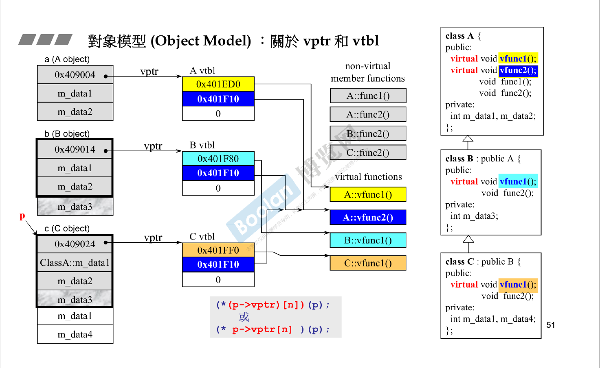

 [TOC]
# OOP(I)
 ## Objected Based(基于对象) 和 Object Oriented(面向对象)
 * OB：面对的是单一Class的设计
 * OO：面对的是多重classes的设计，classes和classes之间的关系

**一个变量有两个阶段：初始化、赋值，对象的构造函数使用初始列效率高于函数体内赋值**

## 内存管理
**new：先分配memmory， 再调用类构造函数**
```C++
Complex* pc = new Complex(1,2)
```
编译器转化为
```C++
Complex* pc;
void* mem = operator new(sizeof(Complex));	//分配内存 内部malloc(n)
pc = static_cast<Complex*>(mem);			//类型转换
pc->Complex::Complex(1,2);					//构造函数
```
**delete：先调用析构函数，再释放memory**
```C++
delete ps;
```
编译器转化为
```C++
String::~String(ps);	//析构函数
operate delete(ps);		//释放内存 内部free(ps)
```
**array new 一定要搭配 array delete**
```C++
String* p = new String[3];
//...
delete[] p;		//唤起3次析构函数，释放p指向的内存
delete p;		//唤起1次析构函数，释放p指向的内存
```
## 类和类之间的关系
* Composition(组合)，表示 has a，一个类里面有另一个类作为成员
	* 构造由内而外，析构由外而内 
* Delegation(委托)，Composition by reference，类里含有指针指向其他类
	* 生命周期不固定
* Inheritance(继承)，表示is a
	* 构造由内而外，析构由外而内 
	* base class 的析构函数必须为virtual

**虚函数与多态**
* 非虚函数：不希望子类重写它

* 虚函数：希望子类重写，且已有默认定义

* 纯虚函数：子类一定要重写它，父类未定义

**Composition和Inheritance构造顺序**
子类先调用父类的构造函数，再调用内部成员类的构造函数，最后调用子类的构造函数，析构顺序相反

# OOP(II)-兼谈对象模型
## 转换函数
```C++
class Fraction
{
public:
	Fraction(int num, int den = 1):m_num(num), m_den(den){}
	operator double const {
		return (double) (m_num / m_den);
	}
private:
	int m_num, m_den;
}

Fraction f(3,5);
double d = 4 + f;	//调用operator double将f转换为0.6
```
**non-explicit-one-arguement ctor**
```C++
class Fraction
{
public:
	Fraction(int num, int den = 1):m_num(num), m_den(den){}
	Fraction operator + (const Fraction& f) {
		return Fraction(...);
	}
private:
	int m_num, m_den;
}

Fraction f(3,5);
Fraction d2 = f + 4;	//调用non-explict ctor将4转为Fraction(4,1)
						//然后调用operator+
```
上面两者(转换函数和non-explicit-one)并存的话```[error]ambiguous```
```explicit Fraction(){}```禁止转化
## pointer-like classes
**智能指针**
```C++
template<class T>
class shared_ptr
{
public:
	T& operator* () const { return *px; }
	T* operator-> () const { return px; }
	shared_ptr(T* p) : px(p) {}
private:
	T*		px;
	long*	pn;
...
};

struct Foo
{
	...
	void method(void){}
};
shared_ptr<Foo> sp(new Foo);
Foo f(*sp);
sp->method();	//px->method()
```
**迭代器**
```C++
reference operate* () const { return (*node).data;}
pointer opearte-> () const { return &(operate*());}
```
## 成员模板(member template)
```C++
template<tyoename _Tp>
class shared_ptr:public __shared_ptr<_Tp>{
...
	template<typename _Tp1>
	explicit shared_ptr(_Tp1* __p):__shared_ptr<_Tp>(__p){}
...
}
class Base1{};
class Drived1: public Base1{};
Base1* ptr = new Derived1;		//up-cast 父类指针指向子类对象
shared_ptr<Base1>sptr(new Derived1);	//智能指针模拟up-cast
```
## 对象模型(Oject Model)
**关于vptr和vtbl**

